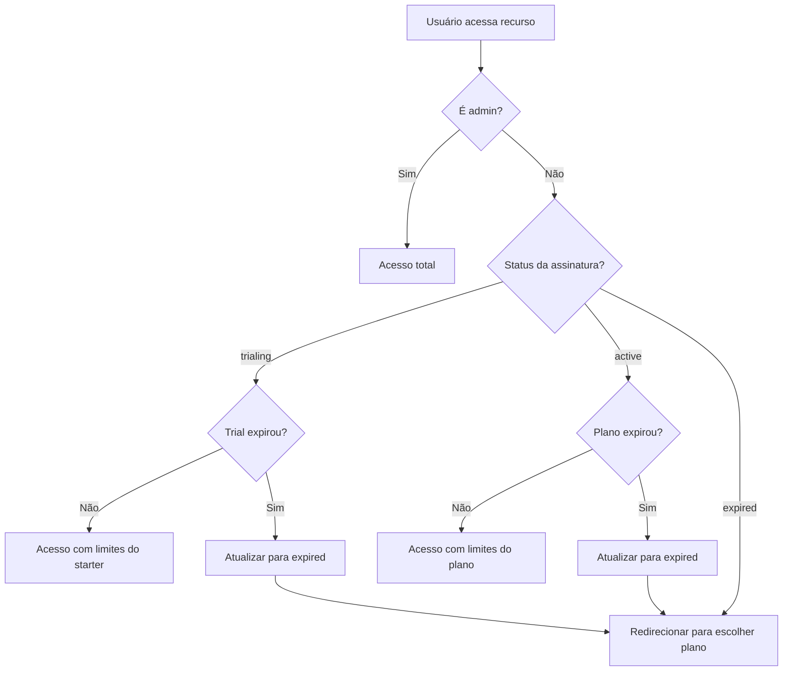

# 📋 Documentação - Sistema de Verificação de Assinatura

## 🎯 Visão Geral

O sistema de verificação de assinatura do Clonup é responsável por controlar o acesso dos usuários às funcionalidades premium, gerenciar períodos de trial e validar limites de uso baseados nos planos contratados.

## 🏗️ Arquitetura do Sistema

### **1. Estrutura de Dados**

#### **Tabela `profiles`**

```sql
CREATE TABLE profiles (
  id UUID PRIMARY KEY,
  subscription_status VARCHAR, -- 'trialing', 'active', 'expired', 'cancelled'
  subscription_tier VARCHAR,   -- 'free', 'pro', 'enterprise'
  plan_id UUID,               -- Referência ao plano contratado
  trial_started_at TIMESTAMP, -- Data de início do trial
  trial_expires_at TIMESTAMP, -- Data de expiração do trial
  subscription_renewed_at TIMESTAMP, -- Data da última renovação
  created_at TIMESTAMP
);
```

#### **Tabela `plans`**

```sql
CREATE TABLE plans (
  id UUID PRIMARY KEY,
  name VARCHAR,           -- 'starter', 'pro', 'enterprise'
  price DECIMAL,          -- Preço mensal
  max_clones INTEGER,     -- Limite de clones
  max_quizzes INTEGER,    -- Limite de quizzes
  quiz_extra_price DECIMAL -- Preço por quiz extra
);
```

## 🔐 Fluxo de Autenticação e Verificação

### **1. Verificação de Acesso (`ProtectedRoute`)**

**Arquivo:** `src/components/ProtectedRoute.tsx`

```typescript
// Verificação principal de acesso
async function checkPlan() {
  if (!profile) return;

  // 1. Verificar se é admin (acesso total)
  if (profile.role === "admin") {
    setRedirectUrl(null);
    setChecking(false);
    return;
  }

  // 2. Verificar trial de 7 dias
  if (profile.subscription_status === "trialing") {
    const trialStatus = checkTrialStatus({
      subscription_status: profile.subscription_status,
      trial_started_at: profile.trial_started_at,
      created_at: profile.created_at,
    });

    // Se o trial expirou, atualizar status
    if (trialStatus.isTrialExpired) {
      await supabase
        .from("profiles")
        .update({ subscription_status: "expired" })
        .eq("id", profile.id);

      setRedirectUrl("/escolher-plano?message=trial_expired");
      return;
    }

    // Trial válido - acesso liberado
    setRedirectUrl(null);
    return;
  }

  // 3. Verificar plano ativo
  if (profile.subscription_status === "active") {
    // Se não tiver data de renovação, está ok (primeira ativação)
    if (!profile.subscription_renewed_at) {
      setRedirectUrl(null);
      return;
    }

    // Verificar se passou de 30 dias desde a renovação
    const renewedAt = new Date(profile.subscription_renewed_at);
    const now = new Date();
    const diffDays =
      (now.getTime() - renewedAt.getTime()) / (1000 * 60 * 60 * 24);

    if (diffDays >= 30) {
      // Atualizar status para expired
      await supabase
        .from("profiles")
        .update({ subscription_status: "expired" })
        .eq("id", profile.id);

      setRedirectUrl("/escolher-plano?message=plan_expired");
      return;
    }
  }

  // 4. Sem acesso válido
  setRedirectUrl("/escolher-plano?message=no_access");
}
```

### **2. Verificação de Trial (`trialUtils.ts`)**

**Arquivo:** `src/utils/trialUtils.ts`

```typescript
export function checkTrialStatus(profile: Profile): TrialStatus {
  const now = new Date();

  // Se não estiver em trial, retorna valores padrão
  if (profile.subscription_status !== "trialing") {
    return {
      isInTrial: false,
      isTrialExpired: false,
      daysRemaining: 0,
      trialStartDate: new Date(profile.created_at),
      trialEndDate: new Date(profile.created_at),
      hasStarterAccess: false,
    };
  }

  // Determina a data de início do trial
  const trialStartDate = profile.trial_started_at
    ? new Date(profile.trial_started_at)
    : new Date(profile.created_at);

  // Calcula a data de fim do trial (7 dias após o início)
  const trialEndDate = new Date(trialStartDate);
  trialEndDate.setDate(trialEndDate.getDate() + 7);

  // Calcula quantos dias se passaram desde o início
  const daysSinceStart = differenceInDays(now, trialStartDate);

  // Calcula quantos dias restam
  const daysRemaining = Math.max(0, 7 - daysSinceStart);

  // Verifica se o trial expirou
  const isTrialExpired = daysSinceStart >= 7;

  return {
    isInTrial: true,
    isTrialExpired,
    daysRemaining,
    trialStartDate,
    trialEndDate,
    hasStarterAccess: !isTrialExpired,
  };
}

export function hasFeatureAccess(profile: Profile): boolean {
  const trialStatus = checkTrialStatus(profile);

  // Se está em trial e não expirou, tem acesso às funcionalidades do starter
  if (trialStatus.isInTrial && !trialStatus.isTrialExpired) {
    return true;
  }

  // Se tem plano ativo, tem acesso
  if (profile.subscription_status === "active") {
    return true;
  }

  // Caso contrário, não tem acesso
  return false;
}
```

## 🎯 Verificação de Limites

### **1. Limite de Clones (`clonesService.ts`)**

**Arquivo:** `src/services/clonesService.ts`

```typescript
export async function checkCloneLimit(userId: string) {
  // 1. Buscar perfil do usuário
  const { data: profile } = await supabase
    .from("profiles")
    .select("*")
    .eq("id", userId)
    .single();

  if (!profile) {
    return {
      allowed: false,
      max: null,
      count: null,
      error: new Error("Perfil não encontrado."),
    };
  }

  // 2. Verificar se o usuário tem acesso
  if (!hasFeatureAccess(profile)) {
    return {
      allowed: false,
      max: null,
      count: null,
      error: new Error(
        "Acesso negado. Você precisa de um plano ativo ou estar no período de teste."
      ),
    };
  }

  let maxClones = 0;

  // 3. Determinar limite baseado no status
  if (profile.subscription_status === "trialing") {
    // Durante o trial, usar limites do plano starter
    const { data: starterPlan } = await supabase
      .from("plans")
      .select("max_clones")
      .eq("name", "starter")
      .single();

    if (starterPlan) {
      maxClones = starterPlan.max_clones;
    } else {
      // Fallback: permitir 3 clones durante o trial
      maxClones = 3;
    }
  } else if (profile.plan_id) {
    // Usuário com plano ativo
    const { data: plan } = await supabase
      .from("plans")
      .select("max_clones")
      .eq("id", profile.plan_id)
      .single();

    if (!plan) {
      return {
        allowed: false,
        max: null,
        count: null,
        error: new Error("Limite do plano não encontrado."),
      };
    }
    maxClones = plan.max_clones;
  } else {
    return {
      allowed: false,
      max: null,
      count: null,
      error: new Error("Plano não encontrado."),
    };
  }

  // 4. Contar clones existentes
  const { count } = await supabase
    .from("cloned_sites")
    .select("id", { count: "exact", head: true })
    .eq("user_id", userId);

  if (typeof count !== "number") {
    return {
      allowed: false,
      max: maxClones,
      count: null,
      error: new Error("Erro ao contar clones."),
    };
  }

  // 5. Verificar se atingiu o limite
  if (count >= maxClones) {
    return {
      allowed: false,
      max: maxClones,
      count,
      error: new Error(
        `Limite de páginas clonadas atingido para seu plano. (${maxClones})`
      ),
    };
  }

  return { allowed: true, max: maxClones, count, error: null };
}
```

### **2. Limite de Quizzes (`quizzesService.ts`)**

**Arquivo:** `src/services/quizzesService.ts`

```typescript
export async function getQuizLimitForUser(userId: string) {
  // 1. Buscar plano do usuário
  const { data: profile } = await supabase
    .from("profiles")
    .select("plan_id")
    .eq("id", userId)
    .single();

  if (!profile || !profile.plan_id) {
    return {
      error: new Error("Plano não encontrado."),
      limit: null,
      price: null,
    };
  }

  // 2. Buscar limites do plano
  const { data: plan } = await supabase
    .from("plans")
    .select("max_quizzes, quiz_extra_price")
    .eq("id", profile.plan_id)
    .single();

  if (!plan) {
    return {
      error: new Error("Limite do plano não encontrado."),
      limit: null,
      price: null,
    };
  }

  return {
    limit: plan.max_quizzes,
    price: plan.quiz_extra_price,
    error: null,
  };
}
```

## 💳 Integração com Stripe

### **1. Webhook do Stripe (`stripe-webhook.ts`)**

**Arquivo:** `supabase/functions/stripe-webhook.ts`

```typescript
serve(async (req) => {
  // 1. Verificar assinatura do webhook
  const sig = req.headers.get("stripe-signature");
  const body = await req.text();

  let event;
  try {
    event = stripe.webhooks.constructEvent(
      body,
      sig!,
      Deno.env.get("STRIPE_WEBHOOK_SECRET")!
    );
  } catch (err) {
    return new Response(`Webhook Error: ${err.message}`, { status: 400 });
  }

  // 2. Processar evento de checkout completado
  if (event.type === "checkout.session.completed") {
    const session = event.data.object as any;
    const userId = session.metadata.userId;
    const planId = session.metadata.planId;

    // 3. Atualizar perfil do usuário
    const now = new Date();
    const trialExpires = new Date(now.getTime() + 7 * 24 * 60 * 60 * 1000);

    await supabase
      .from("profiles")
      .update({
        plan_id: planId,
        subscription_status: "trialing",
        trial_started_at: now.toISOString(),
        trial_expires_at: trialExpires.toISOString(),
      })
      .eq("id", userId);
  }

  return new Response(JSON.stringify({ received: true }), { status: 200 });
});
```

## 🎨 Hook de Assinatura (`useSubscription.ts`)

**Arquivo:** `src/hooks/useSubscription.ts`

```typescript
export function useSubscription() {
  const { profile } = useAuth();
  const [subscriptionInfo, setSubscriptionInfo] = useState<SubscriptionInfo>({
    tier: "free",
    status: null,
    isActive: false,
    features: TIER_FEATURES.free,
  });

  useEffect(() => {
    if (profile) {
      const tier = profile.subscription_tier || "free";
      const status = profile.subscription_status;
      const isActive = status === "active" || status === "trialing";

      setSubscriptionInfo({
        tier,
        status,
        isActive,
        features: TIER_FEATURES[tier || "free"],
      });
    }
  }, [profile]);

  const canAccessFeature = (feature: keyof typeof TIER_FEATURES.free) => {
    return subscriptionInfo.isActive && subscriptionInfo.features[feature];
  };

  const getFeatureLimit = (feature: "maxProjects" | "maxCollaborators") => {
    return subscriptionInfo.features[feature];
  };

  return {
    ...subscriptionInfo,
    canAccessFeature,
    getFeatureLimit,
  };
}
```

## 📊 Status de Assinatura

### **Estados Possíveis:**

1. **`trialing`** - Usuário em período de teste (7 dias)

   - Acesso às funcionalidades do plano starter
   - Limites baseados no plano starter
   - Após 7 dias, muda para `expired`

2. **`active`** - Usuário com plano ativo

   - Acesso completo às funcionalidades do plano
   - Limites baseados no plano contratado
   - Renovação a cada 30 dias

3. **`expired`** - Trial ou plano expirado

   - Sem acesso às funcionalidades premium
   - Redirecionado para página de escolha de plano

4. **`cancelled`** - Plano cancelado
   - Sem acesso às funcionalidades premium
   - Mantém dados até o fim do período pago

### **Fluxo de Verificação:**



## 🔧 Implementação Prática

### **1. Verificar Acesso a Funcionalidade:**

```typescript
import { hasFeatureAccess } from "../utils/trialUtils";

// Verificar se usuário tem acesso
if (!hasFeatureAccess(profile)) {
  // Redirecionar para página de planos
  navigate("/escolher-plano");
  return;
}
```

### **2. Verificar Limite de Clones:**

```typescript
import { checkCloneLimit } from "../services/clonesService";

const limitCheck = await checkCloneLimit(userId);
if (!limitCheck.allowed) {
  alert(limitCheck.error.message);
  return;
}

// Prosseguir com a criação do clone
```

### **3. Usar Hook de Assinatura:**

```typescript
import { useSubscription } from "../hooks/useSubscription";

function MyComponent() {
  const { isActive, canAccessFeature, getFeatureLimit } = useSubscription();

  if (!isActive) {
    return <div>Você precisa de um plano ativo</div>;
  }

  const maxProjects = getFeatureLimit("maxProjects");
  const hasAnalytics = canAccessFeature("analytics");

  return (
    <div>
      <p>Limite de projetos: {maxProjects}</p>
      {hasAnalytics && <AnalyticsComponent />}
    </div>
  );
}
```

## 🚨 Tratamento de Erros

### **Erros Comuns:**

1. **"Perfil não encontrado"** - Usuário não existe na tabela profiles
2. **"Acesso negado"** - Usuário sem plano ativo ou trial válido
3. **"Limite atingido"** - Usuário excedeu o limite do plano
4. **"Plano não encontrado"** - Plano referenciado não existe

### **Redirecionamentos:**

- **Trial expirado:** `/escolher-plano?message=trial_expired`
- **Plano expirado:** `/escolher-plano?message=plan_expired`
- **Sem acesso:** `/escolher-plano?message=no_access`

## 📝 Resumo

O sistema de verificação de assinatura do Clonup é robusto e flexível, oferecendo:

- ✅ **Trial de 7 dias** com acesso às funcionalidades starter
- ✅ **Verificação automática** de expiração de trial e planos
- ✅ **Limites dinâmicos** baseados no plano contratado
- ✅ **Integração com Stripe** para processamento de pagamentos
- ✅ **Hooks reutilizáveis** para verificação de acesso
- ✅ **Tratamento de erros** abrangente
- ✅ **Redirecionamentos automáticos** para página de planos

Este sistema garante que apenas usuários com acesso válido possam utilizar as funcionalidades premium, mantendo a segurança e a monetização da plataforma.
